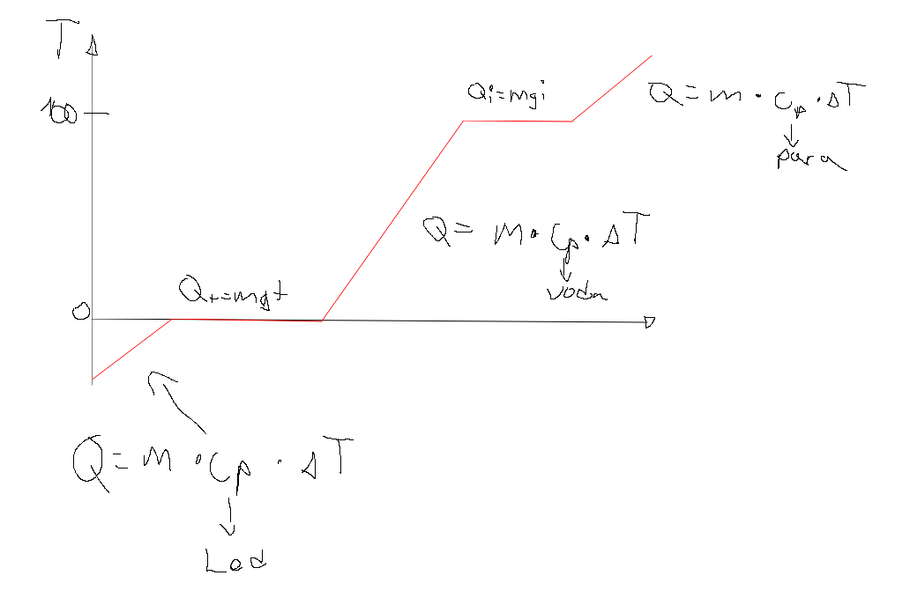
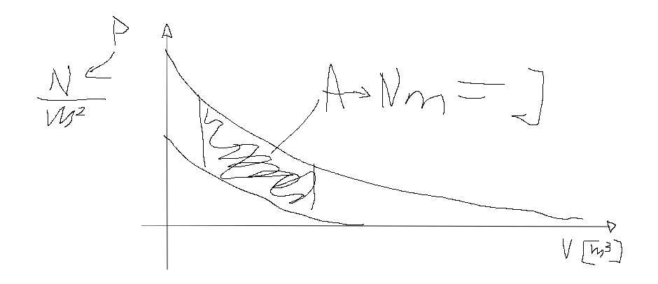

## Načini segrevanja

1. A - Mehansko

2. Q - toplota

3. sevanje

4. $A_{el}$

### Joulovo vreteno

$A = F_s$

$A = m_u g * 2\pi r * N$

$2\pi r$- obrat

$N$- število obratov

$\Delta W_n = A$!

$\Delta W_n \alpha \Delta T$

$C_v$ ... specifična toplota pri stalnem volumnu

$C_v = \frac{\Delta W_n}{m \Delta T}  [\frac{J}{kg*K}]$

### Toplota Q

Toplota Q je energija, ki potuje iz enega telesa na drugo telo, če$T_1$ni$T_2$in se telesa dotikata

Q gre iz toplejšega na hladnejše telo

$Q \alpha m\Delta T$

$Q = mc_p\Delta T$

$c_p$ ... specifična toplota pri stalnem tlaku

### Sevanje

Zakon sevanja črnega telesa

energijski tok$P [W]$

$\frac{W}{T} = P$

gostota električnega toka ...$j = \frac{P}{S} [\frac{W}{m²}]$

### Ael
električno delo ...$A_{el} = UIE \alpha \Delta T$

### Energijski zakon

$A + Q = \Delta W$

$\Delta W = \Delta W_k + \Delta W_p + ...$

## Določanje Cv z električnim delom

$A_{el} = UIt = (m * c_v * \Delta T)$

idealno: $A_{el} = \Delta W_n$

$c_p \approx c_v$

$c_v = \frac{UIt}{m\Delta T}$

## Latentne toplote

$[\frac{J}{kg}] Q_t = m * q_t$ ... talilna toplota

$[\frac{J}{kg}] Q_i = m * q_i$ ... izparilna T

$q_s$ ... specifična sežigna toplota

$[\frac{J}{kg}] Q_s = m * q_s$ ... sežigna toplota

## Toplotni tok

$P_Q = \frac{Q}{t} [\frac{J}{s} = W] = \lambda * \frac{S * \Delta T}{d}$

$\lambda = \frac{P_Q * d}{S * \Delta T} [\frac{W * m}{m^2 * K} = \frac{W}{mK}]$ ... koeficient toplotne prevodnosti

$R = \frac{d}{\lambda * S} [\frac{m * mk}{W * m^2} = \frac{K}{W}]$ ... toplotna upornost

## Toplotni stroji

Deluje med spodno in zgornjo T

$\gamma = \frac{A}{Q_{prejeta}} < 1$

$\gamma = \frac{Q_{prejeta} - Q_{oddana}}{Q_{prejeta}} = 1 - \frac{Q_{oddana}}{Q_{prejeta}} = 1 - \frac{T_z}{T_s}$ ... izkoristek idealnega toplotnega stroja

Če $T_s$ pade ali $T_z$ naraste se $\gamma$ poveča

Vsi toplotni stroji opravljajo KROŽNE spremembe (reverzibilne)

## Hladilni stroji

$\gamma = \frac{Q_{odv}}{A} = \frac{Q_{odv}}{Q_{odd}-Q_{odv}} = \frac{T_s}{T_z-T_s}$

## Toplotna črpalka

$A <<< Q_{odd}$

$\nu_{ti} = \frac{Q_{odd}}{Q_{odd}-Q_{odv}} = \frac{T_z}{T_z-T_s}$ ... učinek

## Štefanov zakon

$j = \omega * T^4$

$P = S * \omega * T^4$

## Kinetična energija plina

$\frac{m_1 * v_1^2}{2} = \frac{3}{2}kT$

$m_1v_1^2 = 3kT$

$T$ ... absolutna T

$k$ ... bolzmanova konstanta

$m_1v_1^2$ ... hitrost ene molekule

$h = \frac{R}{N_A} = 1,38 * 10^{-23} \frac{J}{k}$

$N_A = 6,0 + 10^{23}$
